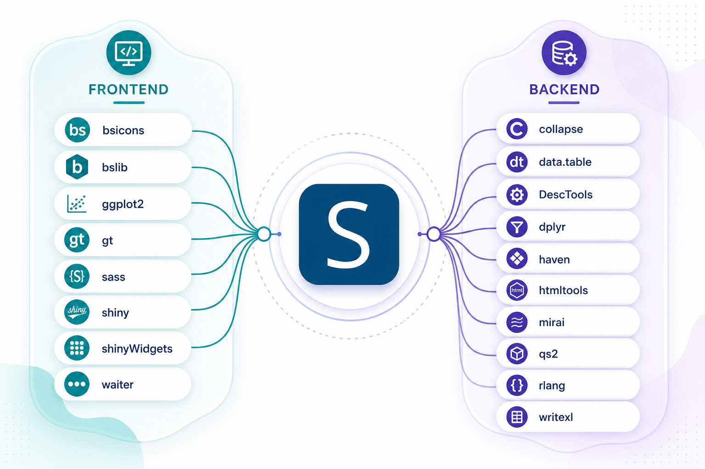

# Preface {.unnumbered}

This is a manual for the [Spada](https://lgschuck.shinyapps.io/spada) package. 
You may find **Spada** on:

-   [CRAN](https://cran.r-project.org/web/packages/spada/index.html)
-   [Github](https://github.com/lgschuck/spada)
-   [Docker](https://hub.docker.com/r/lgschuck/spada/tags)

Spada provides a 'shiny' application with a user-friendly interface for interactive data analysis. It supports exploratory data analysis through descriptive statistics, data visualization, statistical tests (e.g., normality assessment), linear modeling, data import, transformation and reporting.

This package is inspired in many other tools like:

-   IBM SPSS Statistics (<https://www.ibm.com/products/spss-statistics>)

-   R Commander package (<https://CRAN.R-project.org/package=Rcmdr>)

-   Jamovi (<https://www.jamovi.org/>)

-   ydata profiling (<https://docs.profiling.ydata.ai/latest/>)

## Spada Foundations

Spada only exists thanks to the work of many other great R packages.

